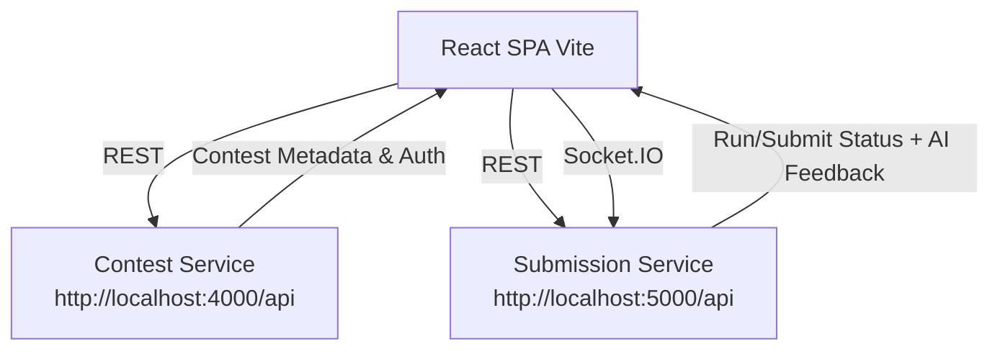
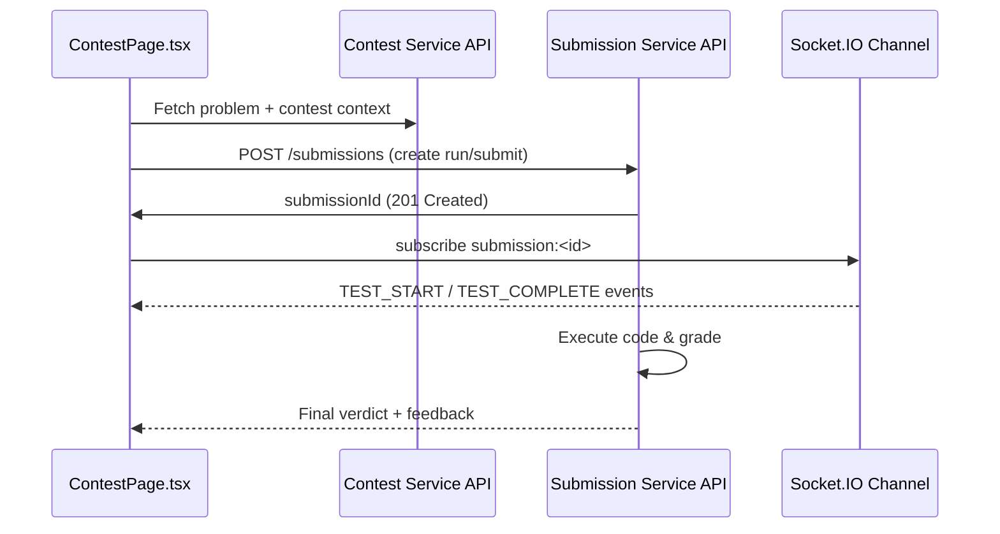

# QuantumJudge Frontend

A modern, contest-focused coding platform UI built with React and TypeScript. It lets contestants solve problems in real time with live verdicts, while organizers manage contests, problems, submissions, and leaderboards.

---

## Table of Contents

1. [Overview](#overview)
2. [Architecture](#architecture)
3. [Folder Structure](#folder-structure)
4. [Tech Stack](#tech-stack)
5. [Environment & Configuration](#environment--configuration)
6. [Local Development](#local-development)
7. [Available npm Scripts](#available-npm-scripts)
8. [API Clients & Endpoints](#api-clients--endpoints)
9. [Key Flows](#key-flows)
10. [Styling & UX Guidelines](#styling--ux-guidelines)
11. [Coding Standards](#coding-standards)
12. [Quality & Tooling](#quality--tooling)
13. [Troubleshooting](#troubleshooting)
14. [Contributing & Developer Notes](#contributing--developer-notes)

---

## Overview

QuantumJudge is a full-stack coding contest platform. The frontend SPA handles:

- **Athlete Experience**: Problem reading, code editing (Monaco), submissions, live verdicts.
- **Organizer Workflows**: Contest creation, problem authoring, managing test cases, dashboards.
- **Real-Time Feedback**: Socket.IO streams run/submit progress directly to the browser.

## Screenshots

<table>
  <tr>
    <td></td>
    <td></td>
  </tr>
  <tr>
    <td></td>
    <td></td>
  </tr>
  <tr>
    <td></td>
    <td></td>
  </tr>
  <tr>
    <td></td>
    <td></td>
  </tr>
</table>


---

## Architecture



### Run / Submit Flow



---

## Folder Structure

```
frontend/
  .env                  # front-end environment variables
  package.json
  vite.config.ts
  public/
    assets/...
  src/
    api/
      axiosContestClient.ts
      axiosSubmissionClient.ts
      contestService.ts
      submissionService.ts
    components/
      contest/
        CodeEditorPanel.tsx
        TestCasePanel.tsx
        DescriptionPanel.tsx
        ResizableDivider.tsx
        index.tsx
    context/
    lib/
    pages/
      contestant/
        ContestPage.tsx
        ContestPageModular.tsx
        ProblemList.tsx
        ContestDetails.tsx
      organizer/
        ProblemCreate.tsx
        OrganizerSubmissions.tsx
        SubmissionDetailView.tsx
      auth/
        Login.tsx
        Register.tsx
    routes/
      index.tsx            # React Router config
    types/
    utils/
    App.tsx
    main.tsx
```

---

## Tech Stack

| Area            | Tech / Library                                           |
|-----------------|----------------------------------------------------------|
| Core            | React 18, TypeScript, Vite 7                             |
| UI Components   | TailwindCSS 4, Lucide Icons, custom themed components    |
| Forms & State   | React Hook Form, React Query (TanStack), React Context   |
| Code Editor     | Monaco Editor                                            |
| Data Fetching   | Axios                                                    |
| Realtime        | Socket.IO Client                                         |
| Charts/Visuals  | Recharts                                                 |
| Auth Storage    | localStorage (token + user metadata)                     |

---

## Environment & Configuration

Create `frontend/.env`:

```env
# REST APIs
VITE_CONTEST_SERVICE_URL=http://localhost:4000/api
VITE_SUBMISSION_SERVICE_URL=http://localhost:5000/api

# Socket fallback (used if import.meta.env.SUBMISSION_SERVICE_URL absent)
SUBMISSION_SERVICE_URL=http://localhost:5000
```

> **Production**: switch hosts to the ALB / deployment URLs:
>
> ```env
> VITE_CONTEST_SERVICE_URL=http://quantum-judge-alb-dev-233767472.us-east-1.elb.amazonaws.com:4000/api
> VITE_SUBMISSION_SERVICE_URL=http://quantum-judge-alb-dev-233767472.us-east-1.elb.amazonaws.com:5000/api
> SUBMISSION_SERVICE_URL=http://quantum-judge-alb-dev-233767472.us-east-1.elb.amazonaws.com:5000
> ```
>
> Ensure backend services share the exact same `JWT_SECRET` so tokens validate across services.

---

## Local Development

1. **Install dependencies**

   ```bash
   npm install
   ```

2. **Run backend services** (from `week6/`):

   ```bash
   # in separate shells
   npm run start --prefix submission-service     # port 5000
   npm run start --prefix user-contest-service   # port 4000
   ```

3. **Start frontend**

   ```bash
   npm run dev
   # Open the Vite URL (commonly http://localhost:5173)
   ```

4. **Build preview**

   ```bash
   npm run build
   npm run preview
   ```

---

## Available npm Scripts

| Script          | Purpose                                       |
|-----------------|-----------------------------------------------|
| `npm run dev`   | Start Vite dev server with hot reload         |
| `npm run build` | Type-check and build the production bundle    |
| `npm run preview` | Serve the production build locally          |
| `npm run lint`  | Run ESLint (TypeScript + React rules)         |

---

## API Clients & Endpoints

### Contest Service (`src/api/contestService.ts`)

| Area         | Method / Endpoint                               |
|--------------|--------------------------------------------------|
| Auth         | POST /auth/signup/organizer, /auth/signup/contestant, /auth/login, /auth/logout, GET /auth/me |
| Contests     | POST /contests, GET /contests, GET /contests/{id}, PUT /contests/{id}, DELETE /contests/{id} |
| Contest Mgmt | POST /contests/{id}/problems, DELETE /contests/problems/{cpId}, POST /contests/{id}/register, GET /contests/me/{created\|registered} |
| Problems     | POST /problems, GET /problems, GET /problems/{id}, PUT /problems/{id}, DELETE /problems/{id}, POST /problems/{id}/testcases |
| Metrics      | GET /organizer/metrics, GET /submissions/latest?limit=5 |
| Health       | GET /health |

### Submission Service (`src/api/submissionService.ts`)

| Area            | Method / Endpoint                             |
|-----------------|-----------------------------------------------|
| Submissions     | POST /submissions, GET /submissions/{id}, GET /submissions/problem/{problemId}, GET /submissions/contest/{contestId} |
| Polling control | `axiosSubmissionClient` handles auth headers + status logging |
| WebSockets      | Socket.IO subscription to `submission:<submissionId>` events |

> **Realtime Events**: `TEST_START`, `TEST_COMPLETE`, `TEST_FAILED`, `ALL_COMPLETE`, plus a final payload with `isComplete`, AI feedback, and points.

---

## Key Flows

### 1. Contestant Run/Submit

1. Validate code editor state.
2. `submissionService.createSubmission`.
3. Subscribe to `submission:{id}` channel.
4. Receive progress, update UI (spinners, test case status, progress bar).
5. Poll REST endpoint as backup to reflect latest touchdown state.

### 2. Organizer Problem Creation

1. Use `ProblemCreate.tsx`.
2. Create base problem.
3. Add visible + hidden testcases (auto-differentiated).
4. Show feedback toast on success, refresh list.

### 3. Contest Navigation

- `ContestPage.tsx` layout: description / editor / test results panels.
- Resizable split panes for flexibility.
- Fullscreen toggles for contest-safe environment (auto requests fullscreen in contest mode).

---

## Styling & UX Guidelines

- **Theme**: Controlled via CSS variables (`index.css`) and theme utility classes.
- **Tailwind Merge**: Use `tailwind-merge` to avoid class conflicts.
- **Icons**: Use `lucide-react`.
- **Toasts**: `react-toastify` wrappers in `utils/toast.ts`.

---

## Coding Standards

- TypeScript only; keep strict typing (avoid `any` unless no alternative).
- Encapsulate API logic in `src/api/`.
- Keep React components functional and hook-based.
- Use React Query for future data fetching if caching is needed.
- Keep consistent logging (`console.info` for success, `console.error` for errors) for network debugging.

---

## Quality & Tooling

- ESLint with React/TS rules (`npm run lint`).
- Format via Prettier defaults / VSCode settings (workspace config).
- Vite's fast HMR ensures quick feedback.

---

## Troubleshooting

| Issue                                 | Resolution |
|---------------------------------------|------------|
| 401 on /submissions                   | Ensure JWT secret matches between Contest & Submission services. |
| Logout triggered during Run/Submit    | `axiosSubmissionClient` now avoids auto-redirect on 401; check backend token validity. |
| 404 on ALB /problems                  | Remote backend lacks route; confirm deployment matches local API contract. |
| Socket not connected                  | Check `SUBMISSION_SERVICE_URL`, network, and backend Socket.IO logs. |

---

## Contributing & Developer Notes

- Keep `.env` secrets out of Git.
- Update this README when adding endpoints or altering architecture.
- For large UI changes, document patterns in `CONTEST_PAGE_MODULARIZATION.md`.
- If you add routes or context providers, update the routing map and architecture diagrams here.

---

Happy hacking!
